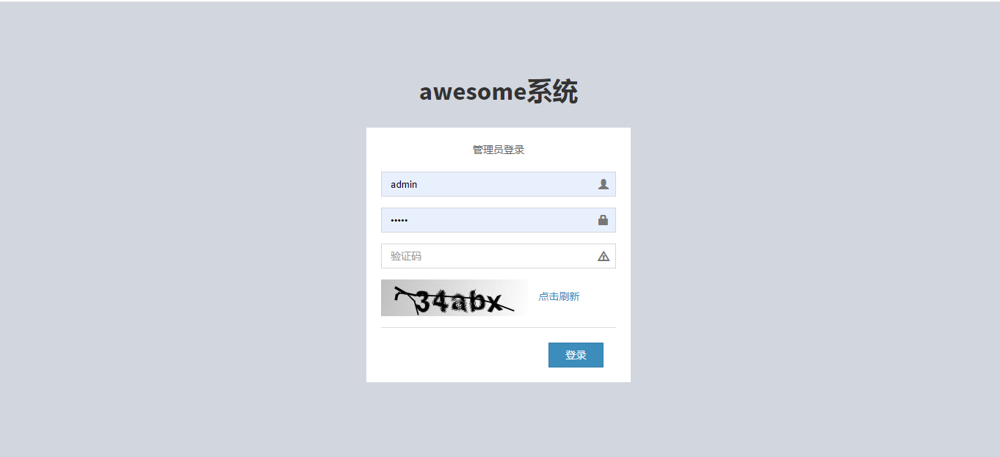
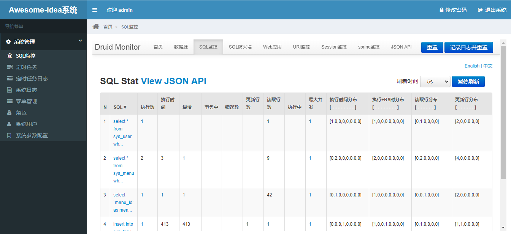
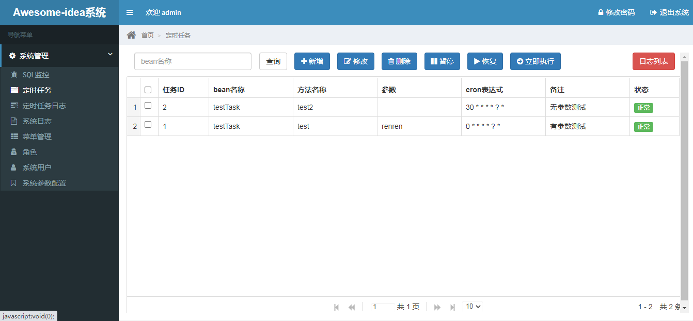

# awe-idea快速开发框架（admin_web + restful_api + schedule_web + user_web）

#### 介绍Spring-MVC + Mybatis + Shiro + Quartz + Druid + Swagger

页面结构来自人人开源框架，精简改造而来，快速开发,适用于中小企业  
合理分层，开箱即用，admin管理和quartz自动任务分开 ,用户移动端api(jwttoken验证+输入参数输出结果AES加密)  
本地存储/redis存储 切换，共享session,sso单点登录   ok  
分布式锁zookeeper     ok  
基本权限管理shiro     ok  
系统日志记录          ok  
基础mybatis代码生成器  ok  
引入集群式quartz定时任务，可动态完成任务的添加、修改、删除、暂停、恢复及日志查看等功能  ok  
解决shiro和spring事务冲突，事务支持  ok  
阿里巴巴Druid sql监控查询  ok  
日志管理：SLF4J 1.7、Log4j ok  

环境：  
JDK1.8  
MySQL5.5+  
Maven3.0+  
Tomcat8.5.16  

项目架构：  
awe-parent        <------> 根项目  
awe-admin         <------> 后台管理web系统页面  
awe-admin-shiro   <------> admin后台权限+session存储redis共享+sso单点登录（admin+batch项目共用）  
awe-admin-batch   <------> quartz执行自动任务+管理页面  
awe-api           <------> 前台用户restful-api，app、h5使用 jwttoken验证+输入参数输出结果AES加密  
awe-common        <------> 公共方法模块，utils  
awe-gen           <------> 基础crud代码生成器模块  
awe-service       <------> 公共服务模块，数据持久层crud, dao，entity，service  
awe-web           <------> 前台用户web页面，session存储redis共享+sso单点登录  

默认账号密码：admin/admin  

项目地址：  
gitee:   https://gitee.com/sam9527/awe-idea  
github:  https://github.com/gitsamyivan/awe-idea 

   

